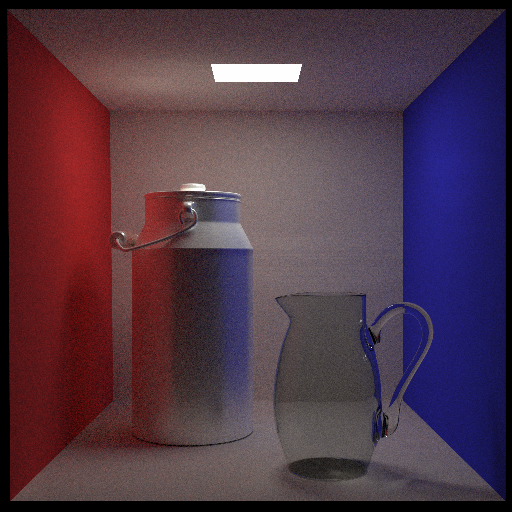
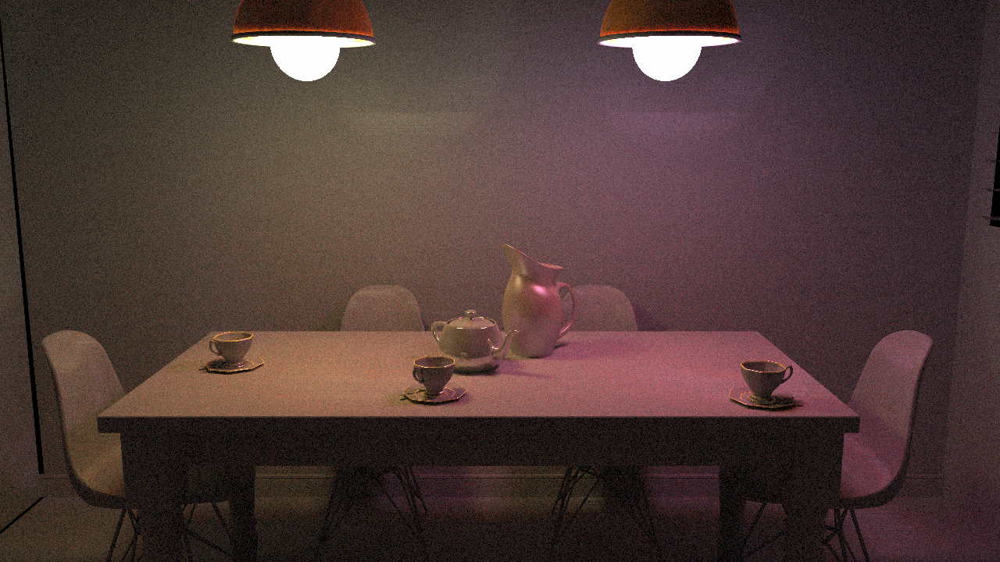
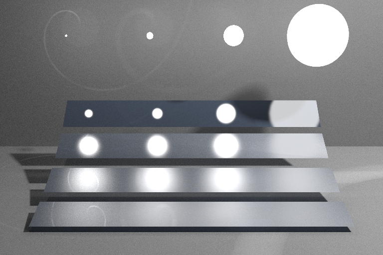
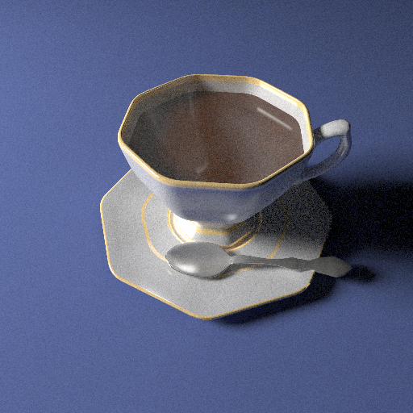

# 蒙特卡洛光线追踪


## 开发环境

- 设备硬件：`Intel(R) Core(TM) i5-8600K CPU @ 3.60GHz`，16G内存。
- 系统及编译环境：`Ubuntu 18.04, g++ 7.5, cmake 3.10`
- 依赖库：`OpenCV 3.2`（用于存储和显示图片）,` Eigen 3.2`（用于数值计算）, `yaml-cpp 0.5.2`（用于读取配置文件），`OpenMP`（用于并行计算）。

## 运行方法

- 安装依赖环境，要求`Ubuntu > 16, OpenCV > 3, Eigen > 3, yaml-cpp, cmake > 2.8, g++ > 5`

  - `sudo apt install -y libeigen3-dev libopencv-dev libyaml-cpp-dev`
  - `sudo apt install cmake g++`

- 在本目录下编译运行（以cbox模型为例）

  - `mkdir build && cd build`
  - `cmake ..`
  - `make`

  - `./Target ../models/cbox.yaml`
  
  运行完成后，默认可在`images`目录下输出相应图片。

- 配置模型文件路径、光线追踪路径深度、图片大小、相机参数等等

  - 请修改`config`目录下的对应模型的配置参数， 以cbox模型为例。
  ```yaml
    object_file_path: "../models/cbox/cbox.obj" #obj文件路径
    material_lib_path: "../models/cbox/cbox.mtl" #mtl文件路径
    save_image_path: "../images/cbox.png" #输出图片路径
    max_depth: 5  #光线追踪路径深度
    max_iteration: 10000  #单个像素采样次数
    position: [278, 273, -800] #光心坐标
    lookat: [278, 273, -799] #屏幕中心坐标
    up: [0, 1, 0] #相机y方向
    fov: 39.3077 #y方向视场角
    width: 512 #图片宽度
    height: 512 #图片高度
  ```
  

## 运行结果

- cbox模型(1万次采样)



- diningroom模型(3000次采样)



- veach_mis模型(10万次采样)



- cup模型(1万次采样)



## 部分实现细节

本仓库使用了git记录了debug和profile的过程，可以通过git日志看到完成此次作业具体过程。

- 解析object file时为了尽可能减少字符串拷贝而未使用C++的string设施，而是使用C语言的标准输入输出自行实现对文本行的split功能，因此可以较快地parse object file, 并且几乎不存在多余的拷贝。为了验证parse效率，[对比了主要的几种split方法](https://github.com/JKTao/StringSplitTest)。
- 在实现KdTree时的划分策略如下：根据物体boundingbox中心划分物体区间，为了均匀化物体在左右区间的分布，使用中位数对区间进行划分。
- debug过程中主要修改了两个错误，一是三角面片判断相交时，必须加入条件t<e(e为一小的正浮点数)，否则无法判定子相交情形，二是在对反射光线进行sample时，必须考虑坐标系转换时对坐标轴的选择，不能简单地选为(0, z, -y), 否则对(0, 0, 1)这样的原始方向将会出错。
- 通过Windows自带的3D查看器可以发现给定的模型文件存在一些问题
  - cbox模型文件的天花板与灯光重合，这导致光线追踪时无法追踪到光源。因此对坐标稍作修改。
  - diningroom模型的墙面存在断线，此条未作处理。


